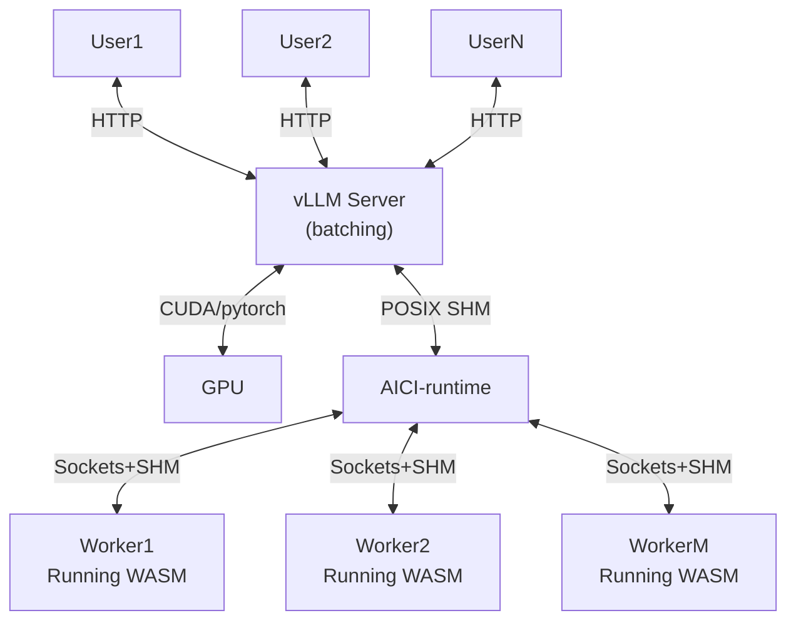
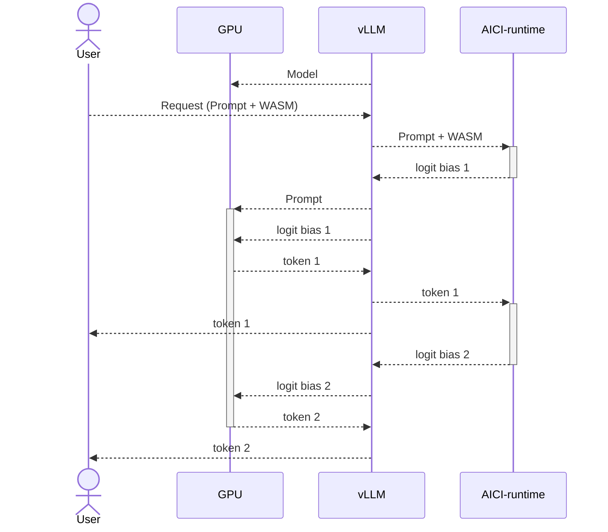
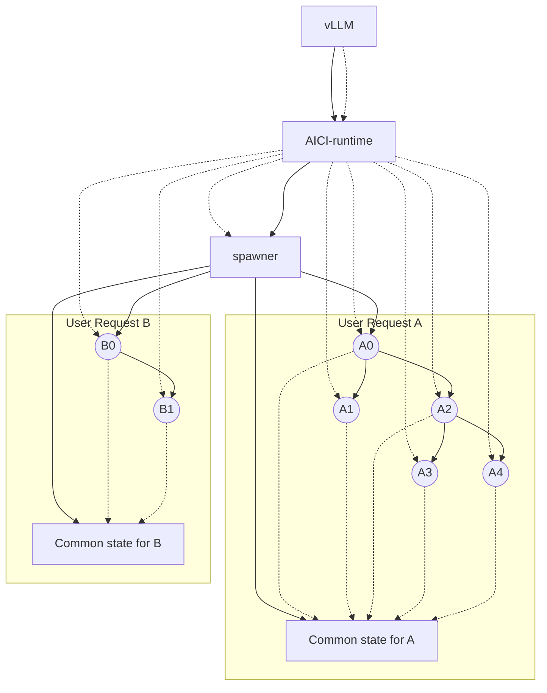

# Artificial Intelligence Controller Interface (AICI)

The Artificial Intelligence Controller Interface (AICI) can be used to constrain output of an LLM in real time.
While the GPU is working on the next token of the output, the AICI VM can use the CPU to
compute a user-provided constraint on the next token.
This adds minimal latency to the LLM generation.

The AICI VM itself is built on top of [Wasmtime](https://wasmtime.dev/).
It takes [WebAssembly](https://webassembly.org/) (WASM) modules with a specific interface
(see below) and executes them in parallel while the LLM inference engine is working on the next token.

The WASM module can be generated in any language that can compile to WASM, but this project focuses on 
Rust for constraints (plus a Python package for interfacing with LLM runtime).


## Getting started

Use Docker container, using the setup in `.devcontainer` (in VSCode "Reopen in container").

The HuggingFace Transformers support is outdated. Do not use `./scripts/hf.sh`.

Setup vLLM with `./scripts/init-vllm.sh`.
It generates files in workspace, so they will survive container rebuilds.
When done (it takes a few minutes), you can test out vLLM with `./scripts/vllm.sh`.

Then run the server (after installing vllm):
* `./scripts/server.sh`
* from a different terminal: `./scripts/upload.py`

You can now also run tests with `pytest` (while the server is running).

## Architecture

This AICI runtime is implemented in the [aicirt](aicirt) crate, while the binary AICI interface 
is specified in the [aici_abi](aici_abi) crate.

The LLM engines are often implemented in Python, and thus the [pyaici](pyaici) Python packages provides
a class to spin up and communicate with `aicirt` process via POSIX shared memory and semaphores.
Using shared memory ensures there is very little work to be done on the Python side
(other than wrapping that memory as a tensor).

The (harness)[harness] folder contains samples for using aicirt with different LLM engines:
- [HuggingFace Transformers](harness/run_hf.py), run with `./scripts/hf.sh`
- [vLLM script](harness/run_vllm.py), run with `./scripts/vllm.sh`
- [vLLM REST server](harness/vllm_server.py), run with `./scripts/server.sh`;
  the REST server is compatible with OpenAI and adds an endpoint for uploading WASM modules;
  see [./scripts/upload.py](scripts/upload.py) for an example on how it can be used






Below is process structure.
* dotted arrow from A to B indicates that A sends requests to B (and gets responses)
* solid arrow from A to B indicates that A spawns (forks) B
* `spawner` is a special process, forked from `aicirt` at the beginning;
  for every user requests it spawns a top-level constraint VM and a `common state` process for handling shared state between
  all VMs for that request (all VMs for that user request can talk to the `common state` process)
* the top-level constraint can spawn more constraints, which can spawn yet more;
  `aicirt` has a direct connection to all these constraints though



## Security

- `aicirt` runs in a separate process, and can run under a different user than the LLM engine
- WASM modules are [sandboxed by Wasmtime](https://docs.wasmtime.dev/security.html)
- WASM only have access to [`aici_host_*` functions](aici_abi/src/host.rs),
  implemented in [hostimpl.rs](aicirt/src/hostimpl.rs)
- `aicirt` also exposes a partial WASI interface; however almost all the functions are no-op, except
  for `fd_write` which shims file descriptors 1 and 2 (stdout and stderr) to print debug messages

In particular, WASM modules cannot access the filesystem, network, or any other resources.
They also cannot spin threads or access any timers (this is relevant for Spectre/Meltdown attacks).

## Interfaces

### Low-level interface

Conceptually, the lowest level interface to AICI constraint is this:

```rust
type TokenId = u32, SeqId = u32;
trait AiciVm {
    /// Called with the initial prompt. ~1000ms time limit.
    fn init_prompt(prompt: [TokenId]);

    /// Called before mid_process(), can fork or suspend. ~1ms.
    fn pre_process() -> enum {
        Stop,
        Continue, // Same as Fork { num_forks: 1 }
        Suspend,  // skip this generation round
        Fork { num_forks: u32 },
    }

    /// This is the main entry point for the module. ~20ms.
    fn mid_process(fork_group: [SeqId]) -> enum {
        Stop,
        SampleWithBias { allowed_tokens: [bool] },
        Splice { backtrack: u32, ff_tokens: [TokenId] }
    };

    /// Called after tokens are appended. ~1ms.
    fn post_process(tokens: [TokenId]) -> enum { Stop, Continue };
}
```

Tokens depend on the tokenizer used (eg., for Llama there 32000 tokens, and for GPT-4 there is ~100k).

The actual binary interface is a bit more complicated, due
to limitations in passing values to and from WASM.
A WASM module instance is created for each token sequence.
Also, when the sequence forks (as in beam search), the module instance is cloned.
See the [AiciVm Rust trait](aici_abi/src/lib.rs) for details.

A number of functions are exposed to the WASM module.

First, there are functions for accessing the current tokenizer:

```rust
/// Given a byte sequence, return a sequence of token Ids.
fn tokenize_bytes(s: [u8]) -> [TokenId];

/// Represents trie of all tokens in the current tokenizer.
impl TokTrie {
    /// Get Id for EOS token etc.
    fn special_token(tok: SpecialToken) -> TokenId;
    /// Number of tokens.
    fn vocab_size() -> usize;
    /// Convert token Id to bytes (often UTF-8 string).
    fn token(token: TokenId) -> [u8];
    /// Given a Recognizer, compute the set of allowed tokens. 
    fn compute_bias(rec: impl Recognizer) -> [bool];
}
```

Different forks in a sequence can communicate via shared variables:

```rust
/// This can be looked up in fork_group.
fn self_seq_id() -> SeqId;

trait VariableStorage {
    fn get(name: str) -> Option<[u8]>;
    fn set(name: str, value: [u8]);
    fn append(name: str, value: [u8]);
}
```

Additionally, the `stdout` and `stderr` file descriptors are captured by the runtime
and returned to user when streaming results.

This interface may need to be extended in the future.

### Byte stack interface

The constraints are typically expressed on strings or bytes, not tokens.
To compute the set of tokens that match a string constraint, one needs go through all the possible tokens
and apply the constraint.
An efficient way to do this is walk a prefix tree (trie) of all tokens.
The `aici_abi` library implements this trie and exposes a way of filtering when provided with a constraints
implementing the [following interface](aici_abi/src/toktree.rs):

```rust
pub trait Recognizer {
    /// If `stack.top()` transitions via `byte` to `X`, execute `stack.push(X)`.
    fn push_byte(&mut self, byte: u8);
    /// for _ in 0..num { stack.pop() }
    fn pop_bytes(&mut self, num: usize);
    /// X = stack.top(); stack.empty(); stack.push(X)
    fn collapse(&mut self);
    /// check if stack.top() transitions via byte to a viable state
    fn byte_allowed(&mut self, byte: u8) -> bool;
    /// check if stack.top() transitions via tok to a viable state
    fn special_allowed(&mut self, tok: SpecialToken) -> bool;
    /// Called when iteration over the trie is finished
    /// Stack has exactly one element then.
    fn trie_finished(&mut self);
    /// This combines `push_byte` and `byte_allowed` into one function for performance.
    fn try_push_byte(&mut self, byte: u8) -> bool;
}
```

The `AiciRecognizer` struct converts `Recognizer` to `AiciVm`.

### Functional byte interface

The following interface can be transformed into `Recognizer` using `StackRecognizer` struct.

```rust
pub trait FunctionalRecognizer<S: Copy> {
    /// Initial state
    fn initial(&self) -> S;
    /// Extend the recognizer with given byte.
    fn append(&self, state: S, byte: u8) -> S;
    /// Check if given byte is allowed in given state.
    fn byte_allowed(&self, state: S, byte: u8) -> bool;
    /// Check if given special token is allowed in given state.
    fn special_allowed(&self, state: S, tok: SpecialToken) -> bool;
}
```

These three layers add up to about 40k of compiled code (WASM).

### Functional string interface

This is not implemented yet, but it could look like this:

```rust
pub trait StringRecognizer<S: Copy> {
    /// Initial state
    fn initial(&self) -> S;
    /// Extend the recognizer with given string.
    fn append(&self, state: S, suffix: &String) -> S;
    /// Return a set of allowed strings in given state.
    fn allowed(&self, state: S) -> Vec<String>;
    /// Check if given special token is allowed in given state.
    fn special_allowed(&self, state: S) -> Vec<SpecialToken>;
}
```


### Regular expressions

The `FunctionalRecognizer` interface is implemented for regular expressions.
The `S` type is the state of the DFA (Deterministic Finite Automaton) that recognizes the regular expression,
then `append()` and `byte_allowed()` are the standard DFA operations,
while `special_allowed()` is only implemented for end-of-sequence token
(which is allowed when the current state is accepting).

### LR(1) grammars

The `Recognizer` interface is implemented for LR(1) grammars and DFA-based lexers.

The grammar uses inline syntax for the lexer:
- `"keyword"` or `'keyword'` for keywords; any string works, eg. `"+="`, `"while"`, ...
- `"/.../"` or `'/.../'` for regular expressions; you cannot have both `'` and `"` in the regex
Special `SKIP` rule is used to indicate tokens that need to be skipped by the LR(1) parser (eg., whitespace and comments)

The lexer has a DFA which recognizes all regexps and keywords
(a big disjunction, but with additional machinery to disambiguate between different branches).
It goes byte by byte, until the DFA gets to a dead state (from which no match is possible).
Then it goes back one byte and checks for match.
It prefers keywords over regexps.
If no match is found, an error is reported, which requires careful design of the lexical part of the grammar
(eg., see how the `white-space` rule below is prefix of the `pre-processor` rule).

For example, this is fragment of [grammar for C](./grammars/c.y):

```yacc
%start translation_unit
%%

SKIP
    : "//\*[^*]*\*+([^/*][^*]*\*+)*//"  // block comment
    | "///.*/"                          // line comment
    | "/\n[ \t\v\f]*#(.*\\\n)*.*/"      // pre-processor
    | "/\n?[ \t\v\f]*/"                 // white-space
    ;

IDENTIFIER: "/[a-zA-Z_][0-9a-zA-Z_]*/" ;

CONSTANT
        : "/0[xX][0-9a-fA-F]+[uUlL]*?/"
        | "/0[0-9]+[uUlL]*?/"
        ;

STRING_LITERAL: '/"(\\.|[^\\"])*"/' ;

primary_expression
    : IDENTIFIER
    | CONSTANT
    | STRING_LITERAL
    | "(" expression ")"
    ;

// ...

enum_specifier
    : "enum" "{" enumerator_list "}"
    | "enum" IDENTIFIER "{" enumerator_list "}"
    | "enum" IDENTIFIER
    ;

// ...

translation_unit
    : external_declaration
    | translation_unit external_declaration
    ;
```

## Contributing

This project welcomes contributions and suggestions.  Most contributions require you to agree to a
Contributor License Agreement (CLA) declaring that you have the right to, and actually do, grant us
the rights to use your contribution. For details, visit https://cla.opensource.microsoft.com.

When you submit a pull request, a CLA bot will automatically determine whether you need to provide
a CLA and decorate the PR appropriately (e.g., status check, comment). Simply follow the instructions
provided by the bot. You will only need to do this once across all repos using our CLA.

This project has adopted the [Microsoft Open Source Code of Conduct](https://opensource.microsoft.com/codeofconduct/).
For more information see the [Code of Conduct FAQ](https://opensource.microsoft.com/codeofconduct/faq/) or
contact [opencode@microsoft.com](mailto:opencode@microsoft.com) with any additional questions or comments.

## Trademarks

This project may contain trademarks or logos for projects, products, or services. Authorized use of Microsoft 
trademarks or logos is subject to and must follow 
[Microsoft's Trademark & Brand Guidelines](https://www.microsoft.com/en-us/legal/intellectualproperty/trademarks/usage/general).
Use of Microsoft trademarks or logos in modified versions of this project must not cause confusion or imply Microsoft sponsorship.
Any use of third-party trademarks or logos are subject to those third-party's policies.
