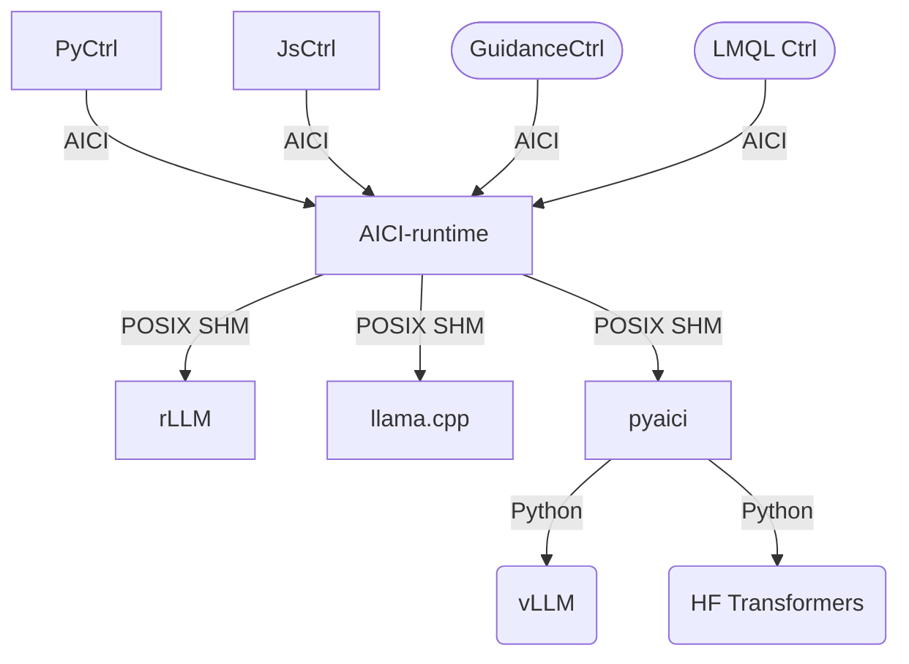

# Artificial Intelligence Controller Interface (AICI)

The Artificial Intelligence Controller Interface (AICI) lets you build Controllers that constrain and direct output of a Large Language Model (LLM) in real time.
Controllers are flexible programs capable of implementating constrained decoding, dynamic editing of prompts and generated text, and coordinating execution across multiple, parallel generations.
Controllers incorporate custom logic during the token-by-token decoding and maintain state during an LLM request. This allows diverse Controller strategies, from programmatic or query-based decoding to multi-agent conversations to execute efficiently in tight integration with the LLM itself.

**The purpose of AICI is to make it easy to build and experiment with both existing and entirely new Controller strategies for improving LLM generations.**
By abstracting away implementation details of the underlying LLM inference and serving engine, AICI aims to simplify the development of Controllers, make it easier to 
write fast Controllers, and ease compatibility across LLM inference and serving engines.

AICI is designed for both local and cloud execution, including (eventually) multi-tenant LLM deployments.
Controllers are implemented as light-weight WebAssembly (Wasm) modules which run on the same machine as the LLM inference engine, utilizing the CPU while the GPU is busy with token generation.
AICI is one layer in the inference stack, and is designed to allow control libraries such as Guidance, LMQL, and others to run over it and gain both efficiency and performance improvements, as well as portability across LLM inference and serving engines.

AICI is:

- [Flexible](#flexibility): Controllers can be written in any language that can compile to Wasm (Rust, C, C++, ...),
  or be interpreted inside Wasm (Python, JavaScript, ...)
- [Secure](#security): Controllers are sandboxed and cannot access the filesystem, network, or any other resources
- [Fast](#performance): Wasm modules are compiled to native code and run in parallel with the LLM inference engine, inducing only a
  minimal overhead to the generation process

AICI is a prototype, designed and built at [Microsoft Research](https://www.microsoft.com/en-us/research/).

> [!TIP]
> We are [looking for a research intern](https://jobs.careers.microsoft.com/us/en/job/1659267). You have to be accepted or currently enrolled in a PhD program or an equivalent research-oriented program in Computer Science or related STEM field.

## Getting started

This repository contains a number of components, and which ones you need depends on your use case.

You can **use an existing controller module**.
We provide [PyCtrl](./pyctrl) and [JsCtrl](./jsctrl)
that let you script controllers using server-side Python and JavaScript, respectively.
The [pyaici](./pyaici) package contains `aici` command line tool that lets you
[upload and run scripts](./proxy.md) with any controller
(we also provide [REST API definition](./REST.md) for the curious).
> 🧑‍💻[Python code samples for scripting PyCtrl](./pyctrl) and a [JavaScript Hello World for JSCtrl](./jsctrl/samples/hello.js)

We anticipate [libraries](#architecture) will be built on top of controllers.
We provide an example in [promptlib](./promptlib) - a client-side Python library
that generates interacts with [DeclCtrl](./declctrl) via the pyaici package.
> 🧑‍💻 [Example notebook that uses PromptLib to interact with DeclCtrl](./promptlib/notebooks/basics_tutorial.ipynb).

The controllers can be run in a cloud or local AICI-enabled LLM inference engine.
You can **run the provided reference engine (rLLM) locally** with either
[libtorch+CUDA](./rllm-cuda) or [llama.cpp backend](./rllm-cpp).

To **develop a new controller**, use a Rust [starter project](./uppercase) that shows usage of [aici_abi](./aici_abi)
library, which simplifies implementing the [low-level AICI interface](aici_abi/README.md#low-level-interface).
> 🧑‍💻[Sample code for a minimal new controller](./uppercase) to get you started

To **add AICI support to a new LLM inference engine**,
you will need to implement LLM-side of the [protocol](aicirt/aicirt-proto.md)
that talks to [AICI runtime](aicirt).

Finally, you may want to modify any of the provided components - PRs are most welcome!

To continue, follow one of the build setups below, and continue
with [running the server](#running-local-server) and [interacting with the server](#interacting-with-server) afterwards.

### Build setup with devcontainers

All of the use cases above, except for running an existing controller on remote server,
require a working [Rust compiler](https://www.rust-lang.org/tools/install),
while compiling rllm-cuda also requires libtorch and CUDA.

- **AICI Client-side** has Rust and C/C++ compilers for developing controllers,
  [rLLM on llama.cpp](./rllm-cpp) and [aicirt](./aicirt)
- **AICI with CUDA** has all of the above, plus CUDA and libtorch for
  [rLLM on libtorch](./rllm-cuda);
  this requires a CUDA-capable GPU (currently only 8.0 (A100) is supported)
- **AICI with CUDA and vLLM (experimental)** is for our outdated vLLM integration

If you're not familiar with [devcontainers](https://containers.dev/),
you need to install the [Dev Containers VSCode extension](https://marketplace.visualstudio.com/items?itemName=ms-vscode-remote.remote-containers)
and from the command palette in VSCode select **Dev Containers: Reopen in Container...**.
It pops a list of available devcontainers, select the one you want to use.

### Build setup on Linux (including WSL2)

This should be roughly equivalent to the **AICI Client-side** devcontainer.
See also [common.dockerfile](.devcontainer/common.dockerfile).

- install required packages; it's likely you already have some or all of these
  but the list should be exhaustive for fresh Ubuntu-22.04 install in WSL

```bash
sudo apt-get install -y --no-install-recommends \
    build-essential ca-certificates ccache \
    cmake curl libjpeg-dev libpng-dev \
    strace linux-tools-common linux-tools-generic \
    llvm-dev libclang-dev clang ccache apache2-utils git-lfs \
    screen bsdmainutils pip python3-dev python-is-python3 \
    nodejs npm pkg-config

pip install pytest pytest-forked ujson posix_ipc numpy requests
```

- [install](https://www.rust-lang.org/tools/install) rustup and restart current shell

```bash
curl --proto '=https' --tlsv1.2 -sSf https://sh.rustup.rs | sh
```

- install rustup components:

```bash
rustup target add wasm32-wasi
rustup component add rustfmt
```

- if you already had rust installed, or are getting complaints from cargo about outdated version,
run:

```bash
rustup update
rustup target add wasm32-wasi
```

- now, [build and run local server](#running-local-server)

### Build setup on macOS

Make sure you have XCode command line tools installed
by running `xcode-select -p` and if not installed, run `xcode-select --install`.

Install required packages via brew:

```bash
brew install cmake git ccache
```

Install rustup as per the [Linux instructions](#build-setup-on-linux-including-wsl2) above.

[Build](#running-local-server) the `rllm-cpp`; it should auto-detect and use Metal acceleration on Apple Silicon.

### Build setup on Windows

Please use a devcontainer or WSL2, as per the [Linux instructions](#build-setup-on-linux-including-wsl2) above.

[Tracking issue](https://github.com/microsoft/aici/issues/42) for native Windows support.

### Running local server

If you have CUDA, go to `rllm-cuda/` and run `./server.sh orca`.
This will run the inference server with Orca-2 13B model (which is expected by testcases).

If you don't have CUDA, go to `rllm-cpp/` and run `./cpp-server.sh phi2`
(phi2 is small enough to run on a CPU).
You can also pass GGUF URL on HuggingFace.

Both of these commands first compile aicirt and the inference engine,
and then run it.
You can also try other models, see README.md files for [rllm-cuda](rllm-cuda/README.md) and
[rllm-cpp](rllm-cpp/README.md) as well as the shell scripts themselves for details.

### Interacting with server

To get started interacting with a cloud AICI server first export the API key.
If running local server, leave `AICI_API_BASE` unset.

```bash
export AICI_API_BASE="https://inference.example.com/v1/#key=wht_..."
```

Now, use query the model with or without AICI Controller:

```bash
./aici.sh infer "The answer to the ultimate question of life"
./aici.sh run --build pyctrl pyctrl/samples/test.py
./aici.sh run --build jsctrl jsctrl/samples/hello.js
./aici.sh run --build aici_abi::yesno
```

Run `./aici.sh -h` to see usage info.

If the server is running with Orca-2 13B model,
you can also run tests with `pytest` for the DeclCtrl, 
with `./scripts/test-pyctrl.sh` for PyCtrl,
or with `./scripts/test-jsctrl.sh` for JsCtrl.

## Architecture

AICI abstracts LLM inference engine from the controller and vice-versa, as in the picture below.
The rounded nodes are aspirational.
Additional layers can be built on top - we provide [promptlib](promptlib),
but we strongly believe that
[Guidance](https://github.com/guidance-ai/guidance),
[LMQL](https://lmql.ai/),
[Outlines](https://github.com/outlines-dev/outlines),
[jsonformer](https://github.com/1rgs/jsonformer),
[LMFE](https://github.com/noamgat/lm-format-enforcer),
etc.
can also run on top of AICI (either with custom controllers or utilizing PyCtrl or JsCtrl).



The [pyaici](pyaici) package makes it easier to integrate AICI with Python-based LLM inference engines.
The support for [HuggingFace Transformers](harness/run_hf.py)
and [vLLM REST server](harness/vllm_server.py) is currently out of date.
Please use the [rLLM-cuda](rllm-cuda) or [rLLM-llama-cpp](rllm-cpp) for now.

## Security

- `aicirt` runs in a separate process, and can run under a different user than the LLM engine
- Wasm modules are [sandboxed by Wasmtime](https://docs.wasmtime.dev/security.html)
- Wasm only have access to [`aici_host_*` functions](aici_abi/src/host.rs),
  implemented in [hostimpl.rs](aicirt/src/hostimpl.rs)
- `aicirt` also exposes a partial WASI interface; however almost all the functions are no-op, except
  for `fd_write` which shims file descriptors 1 and 2 (stdout and stderr) to print debug messages
- each Wasm module runs in a separate process, helping with Spectre/Meltdown mitigation
  and allowing limits on CPU usage

In particular, Wasm modules cannot access the filesystem, network, or any other resources.
They also cannot spin threads or access any timers (this is relevant for Spectre/Meltdown attacks).

## Performance

Most of computation in AICI Controllers occurs on the CPU, in parallel with the logit generation on the GPU.
The generation occurs in steps, where logits are generated in parallel for a new token for each sequence in a batch
(typically between 1 and 50).
This involves reading the whole model and KV caches for sequences in the batch from the GPU memory.
For optimal batch throughput, the model and KV caches should utilize a major fraction of the GPU memory,
and reading the whole memory takes about 40ms on A100 GPU (80GB).

Thus, each step of generation takes on the order of 20-50ms.
With careful engineering,
this is more than enough to compute the set of allowed tokens in Rust compiled to Wasm.
These can be combined either natively in Rust, or via Python or JavaScript interpreters
we provide.

For example, computing allowed token set in the 32000-strong vocabulary of Llama model takes:

- about 2.0ms for Yacc grammar of the C programming language
- about 0.3ms for a regular expression
- about 0.2ms for a substring constraint, from 4kB string

The above numbers are for a single sequence, however each sequence is processed in separate process,
and thus if there is more cores than sequences (which is typical), they do not change.
They also include overhead of calling into Python interpreter implemented in Wasm, and then back into
Rust-generated Wasm code for the constraint itself.
They are all well within the 20-50ms budget, so do not affect the generation time at all.

There is also some overhead in the critical path of sampling. It comes down to about 0.3ms per generation step
when executing 10 sequences in parallel (this is irrespective of the constraint used).
The overhead goes up to around 0.7ms for 40 sequences (though it has not been fully optimized yet).

WebAssembly is designed to have minimal overhead, compared to native code.
In our experience, [highly optimized](aici_abi/implementation.md#token-trie)
Rust code is less than 2x slower when run in
[Wasmtime](https://wasmtime.dev/) than native.
This is 10-100x better than JavaScript or Python.

All measurements done on AMD EPYC 7V13 with nVidia A100 GPU with 80GB of VRAM.

## Flexibility

The low-level interface that AICI runtime provides allows for:

- interaction with the LLM inference engine before, during, and after every generated token
- constraining decoding to a set of tokens
- backtracking KV-cache to a previous state
- fast-forwarding several tokens at a time (if they are known)
- forking generation into multiple branches
- communication between forks via shared variables
- utility functions for converting between tokens and byte strings

It can be utilized from any language that compiles to Wasm.

This repository provides a Rust library that makes it easy to implement controllers in Rust,
and provides [efficient implementations](aici_abi/implementation.md)
of specific constraints ([regular expressions](aici_abi/README.md#regular-expressions),
[yacc grammars](aici_abi/README.md#lr1-grammars), substrings).
We also provide [Python](pyctrl) and [JavaScript](jsctrl) interpreters
that allow to glue these constraints together.
All of these can be easily extended.

## Acknowledgements

- [Flash Attention kernels](tch-cuda/kernels/flash_attn/) are copied from
  [flash-attention repo](https://github.com/Dao-AILab/flash-attention);
  see [BSD LICENSE](tch-cuda/kernels/flash_attn/LICENSE)
- [Paged Attention kernels](tch-cuda/kernels/vllm/) are copied from
  [vLLM repo](https://github.com/vllm-project/vllm);
  see [Apache LICENSE](tch-cuda/kernels/vllm/LICENSE)
- [OpenAI API definitions](rllm-lib/src/server/openai/) are copied and modified from
  [candle-vllm](https://github.com/EricLBuehler/candle-vllm);
  see [MIT LICENSE](rllm-lib/src/server/openai/LICENSE)
- [cache_engine.rs](rllm-cuda/src/llm/paged/cache_engine.rs),
  [config.rs](rllm-lib/src/config.rs),
  and [scheduler.rs](rllm-lib/src/scheduler.rs)
  are loosely based on [vLLM](https://github.com/vllm-project/vllm)
- [llama.rs](rllm-cuda/src/llm/llama.rs), [phi.rs](rllm-cuda/src/llm/phi.rs)
  and [logits.rs](rllm-lib/src/logits.rs) are based on
  [candle-transformers](https://github.com/huggingface/candle/tree/main/candle-transformers)
- specific [Python library](./pyctrl/Lib/) files are copied from
  [RustPython](https://github.com/RustPython/RustPython)
  (as we only use a subset of them)
- the [example ANSI C grammar](aici_abi/grammars/c.y) is based on
  https://www.lysator.liu.se/c/ANSI-C-grammar-y.html by Jeff Lee (from 1985)

## Contributing

This project welcomes contributions and suggestions. Most contributions require you to agree to a
Contributor License Agreement (CLA) declaring that you have the right to, and actually do, grant us
the rights to use your contribution. For details, visit https://cla.opensource.microsoft.com.

When you submit a pull request, a CLA bot will automatically determine whether you need to provide
a CLA and decorate the PR appropriately (e.g., status check, comment). Simply follow the instructions
provided by the bot. You will only need to do this once across all repos using our CLA.

This project has adopted the [Microsoft Open Source Code of Conduct](https://opensource.microsoft.com/codeofconduct/).
For more information see the [Code of Conduct FAQ](https://opensource.microsoft.com/codeofconduct/faq/) or
contact [opencode@microsoft.com](mailto:opencode@microsoft.com) with any additional questions or comments.

## Trademarks

This project may contain trademarks or logos for projects, products, or services. Authorized use of Microsoft
trademarks or logos is subject to and must follow
[Microsoft's Trademark & Brand Guidelines](https://www.microsoft.com/en-us/legal/intellectualproperty/trademarks/usage/general).
Use of Microsoft trademarks or logos in modified versions of this project must not cause confusion or imply Microsoft sponsorship.
Any use of third-party trademarks or logos are subject to those third-party's policies.
