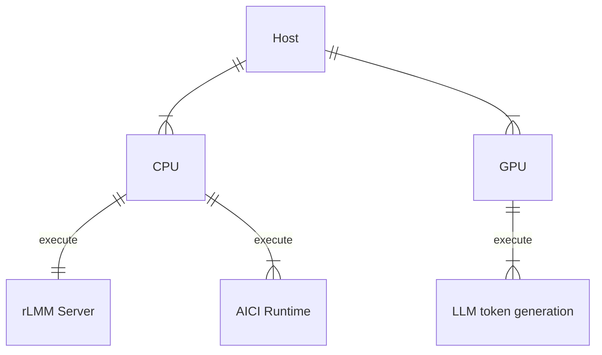
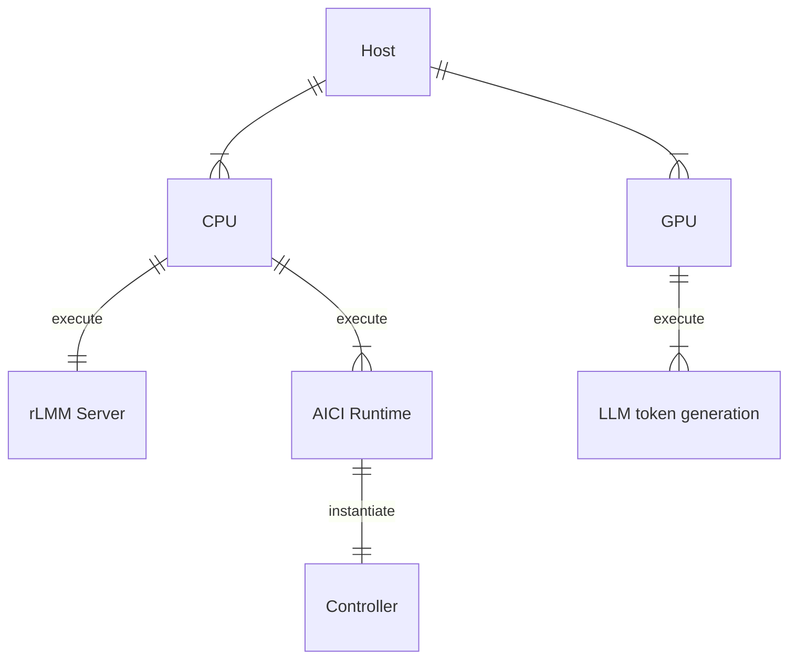

# Artificial Intelligence Controller Interface (AICI)

The Artificial Intelligence Controller Interface (AICI) lets you build Controllers that constrain and direct output of a Large Language Model (LLM) in real time.
Controllers are flexible programs capable of implementing constrained decoding, dynamic editing of prompts and generated text, and coordinating execution across multiple, parallel generations.
Controllers incorporate custom logic during the token-by-token decoding and maintain state during an LLM request. This allows diverse Controller strategies, from programmatic or query-based decoding to multi-agent conversations to execute efficiently in tight integration with the LLM itself.

**The purpose of AICI is to make it easy to build and experiment with both existing and entirely new Controller strategies for improving LLM generations.**
By abstracting away implementation details of the underlying LLM inference and serving engine, AICI aims to simplify the development of Controllers, make it easier to 
write fast Controllers, and ease compatibility across LLM inference and serving engines.

AICI is designed for both local and cloud execution, including (eventually) multi-tenant LLM deployments.
Controllers are implemented as light-weight WebAssembly (Wasm) modules which run on the same machine as the LLM inference engine, utilizing the CPU while the GPU is busy with token generation.
AICI is one layer in the inference stack, and is designed to allow control libraries such as Guidance, LMQL, and others to run over it and gain both efficiency and performance improvements, as well as portability across LLM inference and serving engines.

AICI is:

- [Flexible](#flexibility): Controllers can be written in any language that can compile to Wasm (Rust, C, C++, ...),
  or be interpreted inside Wasm (Python, JavaScript, ...)
- [Secure](#security): Controllers are sandboxed and cannot access the filesystem, network, or any other resources
- [Fast](#performance): Wasm modules are compiled to native code and run in parallel with the LLM inference engine, inducing only a
  minimal overhead to the generation process

AICI is a prototype, designed and built at [Microsoft Research](https://www.microsoft.com/en-us/research/).

> [!TIP]
> We are [looking for a research intern](https://jobs.careers.microsoft.com/us/en/job/1659267). You have to be accepted or currently enrolled in a PhD program or an equivalent research-oriented program in Computer Science or related STEM field.

# Table of Contents

- [Artificial Intelligence Controller Interface (AICI)](#artificial-intelligence-controller-interface-aici)
- [QuickStart: Example Walkthrough](#quickstart-example-walkthrough)
  - [Development Environment Setup](#development-environment-setup)
  - [Build and start rLLM server and AICI Runtime](#build-and-start-rllm-server-and-aici-runtime)
  - [Control AI output using AICI controllers](#control-ai-output-using-aici-controllers)
- [Comprehensive Guide: Exploring Further](#comprehensive-guide-exploring-further)
- [Architecture](#architecture)
- [Security](#security)
- [Performance](#performance)
- [Flexibility](#flexibility)
- [Acknowledgements](#acknowledgements)
- [Contributing](#contributing)
- [Trademarks](#trademarks)

# QuickStart: Example Walkthrough

In this quickstart, we'll guide you through the following steps:

* Setting up **rLLM Server** and **AICI Runtime**.
* Building and deploying a **Controller**.
* Utilizing AICI to control LLM output, enabling the customization of an LLM to **generate text adhering to specific rules**.

## Development Environment Setup

Begin by preparing your development environment for compiling AICI components, primarily coded in Rust. Additionally, ensure that Python 3.11 or later is installed, as it is essential for crafting controllers.

### Windows WSL / Linux / macOS

> [!NOTE]
> **Windows users**: please use WSL2 or the included [devcontainer](https://containers.dev). Adding native Windows support [is tracked here](https://github.com/microsoft/aici/issues/42).
> 
> **MacOS users**: please make sure you have XCode command line tools installed by running `xcode-select -p` and if not installed, run `xcode-select --install`.
>
> **CUDA**: the CUDA build relies on specific libtorch installation. It's highly recommended you use the included devcontainer.

If you're using devcontainer, you can skip to the [next section](#build-and-start-rllm-server-and-aici-runtime).

Using the system package manager, install the necessary tools for building code in the repository, including `git`, `cmake` and `ccache`. 

For instance in WSL / Ubuntu using `apt`:

    sudo apt-get install -y --no-install-recommends build-essential cmake ccache pkg-config libssl-dev libclang-dev clang llvm-dev git-lfs

or using Homebrew on macOS:

    brew install git cmake ccache

Then install **Rust, Rustup and Cargo** following the instructions provided [here](https://doc.rust-lang.org/cargo/getting-started/installation.html) and [here](https://www.rust-lang.org/learn/get-started).

    curl --proto '=https' --tlsv1.2 -sSf https://sh.rustup.rs | sh

After installation, verify that the `rustup --version` command is accessible by running it from the terminal. If the command isn't recognized, try opening a new terminal session.
  
Next install wasm32-wasi component:
    
    rustup target add wasm32-wasi

If you already had Rust installed, or are getting complaints from cargo about outdated versions, run:

    rustup update

Finally, if you plan working with **Python** controllers and scripts, install these packages:

    pip install pytest pytest-forked ujson posix_ipc numpy requests


## Build and start rLLM server and AICI Runtime

Clone the AICI repository and proceed with the next steps outlined below.

### Using CUDA (rllm-cuda)

If your platform has a CUDA-capable GPU (currently only compute capability 8.0 is supported; this includes A100+ or GeForce 30x0/40x0), navigate to the `rllm-cuda` folder and run the command below. This folder contains specific implementations tailored for CUDA-supported platforms.

    cd rllm-cuda/
    ./server.sh build

After completing the build process, you can start it, specifying a model name, URL, or path as a parameter:

    ./server.sh phi2

If you prefer using Orca-2 13B model run this command:

    ./server.sh orca

You can find more details about `rllm-cuda` [here](rllm-cuda/README.md).

### Using llama.cpp (rllm-cpp)

For those utilizing Apple ARM-based M series processors or lacking CUDA capabilities but still aiming to run models on the CPU, use the following command from the `rllm-cpp` folder, which is derived from the llama.cpp project:

    cd rllm-cpp
    ./cpp-server.sh phi2

After completing the build process, you can start it, specifying a model name, URL, or path as a parameter:

    ./cpp-server.sh phi2

You can find more details about `rllm-cpp` [here](rllm-cpp/README.md).

### Server overview

At this stage, your rLLM server instance should be up and running, nearly prepared to handle incoming requests. The following diagram illustrates how AICI and LLMs utilize CPU and GPU resources:



The rLLM server provides an HTTP interface, utilized for both configuration tasks and sending requests. You can also utilize this interface to promptly verify its status. For instance, if you open http://127.0.0.1:4242/v1/models, you should see:

```json
{
  "object": "list",
  "data": [
    {
      "object": "model",
      "id": "TheBloke/phi-2-GGUF",
      "created": 946810800,
      "owned_by": "owner"
    }
  ]
}
```

confirming that the selected model is loaded.

## Control AI output using AICI controllers

AICI provides the capability to host custom logic known as **Controllers**, enabling the initiation, termination, and interaction with LLMs token generation. Each controller accepts input arguments, processes them, and returns a result comprising logs, LLM tokens, and variables.

The repository includes some examples, in particular:

* **jsctrl**: a controller that accepts JavaScript code as input for execution. This code can interact with the model to generate text and tokens.
* **pyctrl**: a controller that accepts Python code as input for execution. This code can also interact with the model to generate text and tokens.

In this example we'll utilize **pyctrl** to manage token generation using a simple **Python script**. It's important to note that controllers require building and deployment, while scripts are sent with each request.

### Build and Upload pyctrl controller

Execute the following command to build and upload the controller to the rLLM server:

    ./aici.sh build pyctrl/ --tag pyctrl-latest

The command utilizes the `aici.sh` utility to build the code in the `pyctrl/` folder, assigning a tag to the deployment. You can view all the deployed tags at http://127.0.0.1:4242/v1/controllers/tags or running with `aici.sh` command:

    ./aici.sh tags

output:

> pyctrl-latest -> 68488575...; 13.3MiB/37.6MiB (2024-02-06 15:16:47 by localhost)


At this point, you should have an rLLM server instance running with your controller, fully prepared to handle incoming requests. The following diagram integrates the controller just uploaded:



### Controlling the LLM token generation

Suppose we aim for a model to generate a list, adhering to a specific format and containing only five items.

Typically, achieving this involves prompt engineering, crafting the prompt precisely with clear instructions, such as:

    What are the five most popular types of vehicles?
    Return the result as a numbered list.
    Do not add explanations, only the list.

The prompt would also vary depending on the model in use, given that each model tend to add explanations and understand instructions in different ways.

With AICI, we shift control back to code, and we can simplify the prompt to:

    What are the most popular types of vehicles?

using code to:

1. Limit the list to 5 items
2. Prevent the model from adding some initial explanation
3. Format to a numbered list
4. Stop the model from adding some text after the list.

Let's create a `list-of-five.py` python file with the following content:

```python
import pyaici.server as aici

# Force the model to generate a well formatted list of 5 items, e.g.
#   1. name 1
#   2. name 2
#   3. name 3
#   4. name 4
#   5. name 5
async def main():
    
    # This is the prompt we want to run. Note that the prompt doesn't mention a number of vehicles.
    prompt = "What are the most popular types of vehicles?\n"

    # Tell the model to generate the prompt string, ie. let's start with the prompt "to complete"
    await aici.FixedTokens(prompt)

    # Store the current position in the token generation process
    marker = aici.Label()

    for i in range(1,6):
      # Tell the model to generate the list number
      await aici.FixedTokens(f"{i}.")

      # Wait for the model to generate a vehicle name and end with a new line
      await aici.gen_text(stop_at = "\n")

    await aici.FixedTokens("\n")

    # Store the tokens generated in a result variable
    aici.set_var("result", marker.text_since())

aici.start(main())
```

Running the script is not too different from sending a prompt. In this case, we're sending control logic and instructions all together.

To see the final result, execute the following command:

    ./aici.sh run list-of-five.py

Result:
```
Running with tagged AICI Controller: pyctrl-latest
[0]: FIXED 'What are the most popular types of vehicles?\n'
[0]: FIXED '1.'
[0]: GEN ' Sedans\n'
[0]: FIXED '2.'
[0]: GEN ' SUVs\n'
[0]: FIXED '3.'
[0]: GEN ' Trucks\n'
[0]: FIXED '4.'
[0]: GEN ' Sports cars\n'
[0]: FIXED '5.'
[0]: GEN ' Minivans\n'
[0]: FIXED '\n'
[DONE]
[Response] What are the most popular types of vehicles?
1. Sedans
2. SUVs
3. Trucks
4. Sports cars
5. Minivans


response saved to tmp/response.json
Usage: {'sampled_tokens': 17, 'ff_tokens': 38, 'cost': 72}
Storage: {'result': '1. Sedans\n2. SUVs\n3. Trucks\n4. Sports cars\n5. Minivans\n\n'}
```

# Comprehensive Guide: Exploring Further

This repository contains a number of components, and which ones you need depends on your use case.

You can **use an existing controller module**.
We provide [PyCtrl](./pyctrl) and [JsCtrl](./jsctrl)
that let you script controllers using server-side Python and JavaScript, respectively.
The [pyaici](./pyaici) package contains `aici` command line tool that lets you
[upload and run scripts](./proxy.md) with any controller
(we also provide [REST API definition](./REST.md) for the curious).
> 🧑‍💻[Python code samples for scripting PyCtrl](./pyctrl) and a [JavaScript Hello World for JSCtrl](./jsctrl/samples/hello.js)

We anticipate [libraries](#architecture) will be built on top of controllers.
We provide an example in [promptlib](./promptlib) - a client-side Python library
that generates interacts with [DeclCtrl](./declctrl) via the pyaici package.
> 🧑‍💻 [Example notebook that uses PromptLib to interact with DeclCtrl](./promptlib/notebooks/basics_tutorial.ipynb).

The controllers can be run in a cloud or local AICI-enabled LLM inference engine.
You can **run the provided reference engine (rLLM) locally** with either
[libtorch+CUDA](./rllm-cuda) or [llama.cpp backend](./rllm-cpp).

To **develop a new controller**, use a Rust [starter project](./uppercase) that shows usage of [aici_abi](./aici_abi)
library, which simplifies implementing the [low-level AICI interface](aici_abi/README.md#low-level-interface).
> 🧑‍💻[Sample code for a minimal new controller](./uppercase) to get you started

To **add AICI support to a new LLM inference engine**,
you will need to implement LLM-side of the [protocol](aicirt/aicirt-proto.md)
that talks to [AICI runtime](aicirt).

Finally, you may want to modify any of the provided components - PRs are most welcome!

# Architecture

AICI abstracts LLM inference engine from the controller and vice-versa, as in the picture below.
The rounded nodes are aspirational.
Additional layers can be built on top - we provide [promptlib](promptlib),
but we strongly believe that
[Guidance](https://github.com/guidance-ai/guidance),
[LMQL](https://lmql.ai/),
[Outlines](https://github.com/outlines-dev/outlines),
[jsonformer](https://github.com/1rgs/jsonformer),
[LMFE](https://github.com/noamgat/lm-format-enforcer),
etc.
can also run on top of AICI (either with custom controllers or utilizing PyCtrl or JsCtrl).


The [pyaici](pyaici) package makes it easier to integrate AICI with Python-based LLM inference engines.
The support for [HuggingFace Transformers](scripts/py/run_hf.py)
and [vLLM REST server](scripts/py/vllm_server.py) is currently out of date.
Please use the [rLLM-cuda](rllm-cuda) or [rLLM-llama-cpp](rllm-cpp) for now.

# Security

- `aicirt` runs in a separate process, and can run under a different user than the LLM engine
- Wasm modules are [sandboxed by Wasmtime](https://docs.wasmtime.dev/security.html)
- Wasm only have access to [`aici_host_*` functions](aici_abi/src/host.rs),
  implemented in [hostimpl.rs](aicirt/src/hostimpl.rs)
- `aicirt` also exposes a partial WASI interface; however almost all the functions are no-op, except
  for `fd_write` which shims file descriptors 1 and 2 (stdout and stderr) to print debug messages
- each Wasm module runs in a separate process, helping with Spectre/Meltdown mitigation
  and allowing limits on CPU usage

In particular, Wasm modules cannot access the filesystem, network, or any other resources.
They also cannot spin threads or access any timers (this is relevant for Spectre/Meltdown attacks).

# Performance

Most of computation in AICI Controllers occurs on the CPU, in parallel with the logit generation on the GPU.
The generation occurs in steps, where logits are generated in parallel for a new token for each sequence in a batch
(typically between 1 and 50).
This involves reading the whole model and KV caches for sequences in the batch from the GPU memory.
For optimal batch throughput, the model and KV caches should utilize a major fraction of the GPU memory,
and reading the whole memory takes about 40ms on A100 GPU (80GB).

Thus, each step of generation takes on the order of 20-50ms.
With careful engineering,
this is more than enough to compute the set of allowed tokens in Rust compiled to Wasm.
These can be combined either natively in Rust, or via Python or JavaScript interpreters
we provide.

For example, computing allowed token set in the 32000-strong vocabulary of Llama model takes:

- about 2.0ms for Yacc grammar of the C programming language
- about 0.3ms for a regular expression
- about 0.2ms for a substring constraint, from 4kB string

The above numbers are for a single sequence, however each sequence is processed in separate process,
and thus if there is more cores than sequences (which is typical), they do not change.
They also include overhead of calling into Python interpreter implemented in Wasm, and then back into
Rust-generated Wasm code for the constraint itself.
They are all well within the 20-50ms budget, so do not affect the generation time at all.

There is also some overhead in the critical path of sampling. It comes down to about 0.3ms per generation step
when executing 10 sequences in parallel (this is irrespective of the constraint used).
The overhead goes up to around 0.7ms for 40 sequences (though it has not been fully optimized yet).

WebAssembly is designed to have minimal overhead, compared to native code.
In our experience, [highly optimized](aici_abi/implementation.md#token-trie)
Rust code is less than 2x slower when run in
[Wasmtime](https://wasmtime.dev/) than native.
This is 10-100x better than JavaScript or Python.

All measurements done on AMD EPYC 7V13 with nVidia A100 GPU with 80GB of VRAM.

# Flexibility

The low-level interface that AICI runtime provides allows for:

- interaction with the LLM inference engine before, during, and after every generated token
- constraining decoding to a set of tokens
- backtracking KV-cache to a previous state
- fast-forwarding several tokens at a time (if they are known)
- forking generation into multiple branches
- communication between forks via shared variables
- utility functions for converting between tokens and byte strings

It can be utilized from any language that compiles to Wasm.

This repository provides a Rust library that makes it easy to implement controllers in Rust,
and provides [efficient implementations](aici_abi/implementation.md)
of specific constraints ([regular expressions](aici_abi/README.md#regular-expressions),
[yacc grammars](aici_abi/README.md#lr1-grammars), substrings).
We also provide [Python](pyctrl) and [JavaScript](jsctrl) interpreters
that allow to glue these constraints together.
All of these can be easily extended.

# Acknowledgements

- [Flash Attention kernels](tch-cuda/kernels/flash_attn/) are copied from
  [flash-attention repo](https://github.com/Dao-AILab/flash-attention);
  see [BSD LICENSE](tch-cuda/kernels/flash_attn/LICENSE)
- [Paged Attention kernels](tch-cuda/kernels/vllm/) are copied from
  [vLLM repo](https://github.com/vllm-project/vllm);
  see [Apache LICENSE](tch-cuda/kernels/vllm/LICENSE)
- [OpenAI API definitions](rllm-lib/src/server/openai/) are copied and modified from
  [candle-vllm](https://github.com/EricLBuehler/candle-vllm);
  see [MIT LICENSE](rllm-lib/src/server/openai/LICENSE)
- [cache_engine.rs](rllm-cuda/src/llm/paged/cache_engine.rs),
  [config.rs](rllm-lib/src/config.rs),
  and [scheduler.rs](rllm-lib/src/scheduler.rs)
  are loosely based on [vLLM](https://github.com/vllm-project/vllm)
- [llama.rs](rllm-cuda/src/llm/llama.rs), [phi.rs](rllm-cuda/src/llm/phi.rs)
  and [logits.rs](rllm-lib/src/logits.rs) are based on
  [candle-transformers](https://github.com/huggingface/candle/tree/main/candle-transformers)
- specific [Python library](./pyctrl/Lib/) files are copied from
  [RustPython](https://github.com/RustPython/RustPython)
  (as we only use a subset of them)
- the [example ANSI C grammar](aici_abi/grammars/c.y) is based on
  https://www.lysator.liu.se/c/ANSI-C-grammar-y.html by Jeff Lee (from 1985)

# Contributing

This project welcomes contributions and suggestions. Most contributions require you to agree to a
Contributor License Agreement (CLA) declaring that you have the right to, and actually do, grant us
the rights to use your contribution. For details, visit https://cla.opensource.microsoft.com.

When you submit a pull request, a CLA bot will automatically determine whether you need to provide
a CLA and decorate the PR appropriately (e.g., status check, comment). Simply follow the instructions
provided by the bot. You will only need to do this once across all repos using our CLA.

This project has adopted the [Microsoft Open Source Code of Conduct](https://opensource.microsoft.com/codeofconduct/).
For more information see the [Code of Conduct FAQ](https://opensource.microsoft.com/codeofconduct/faq/) or
contact [opencode@microsoft.com](mailto:opencode@microsoft.com) with any additional questions or comments.

# Trademarks

This project may contain trademarks or logos for projects, products, or services. Authorized use of Microsoft
trademarks or logos is subject to and must follow
[Microsoft's Trademark & Brand Guidelines](https://www.microsoft.com/en-us/legal/intellectualproperty/trademarks/usage/general).
Use of Microsoft trademarks or logos in modified versions of this project must not cause confusion or imply Microsoft sponsorship.
Any use of third-party trademarks or logos are subject to those third-party's policies.
