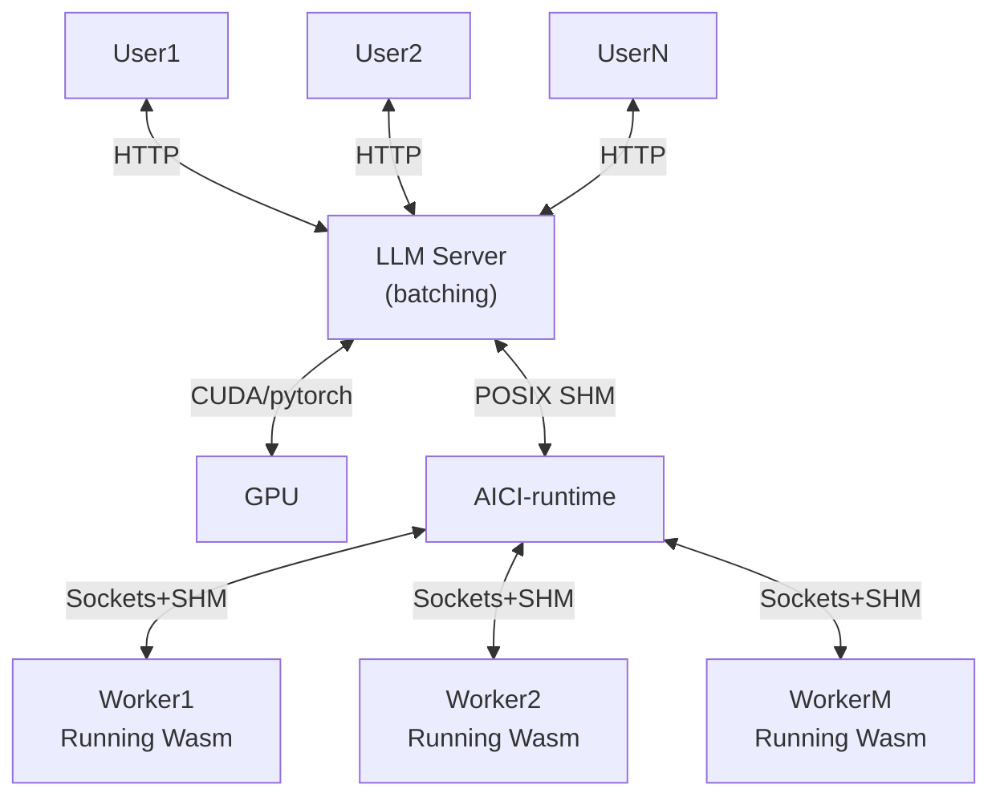
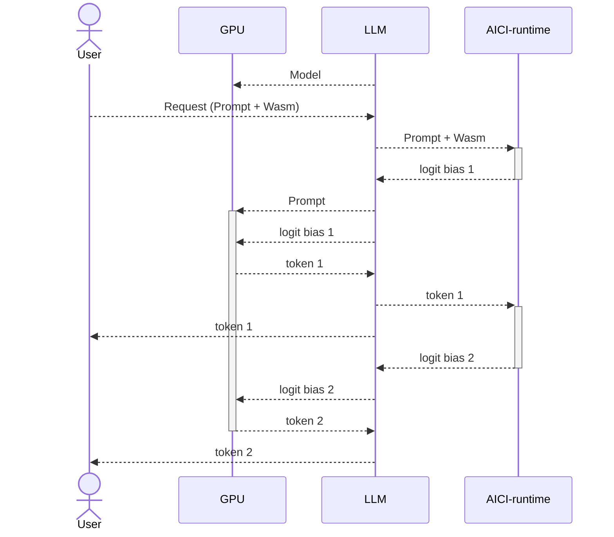
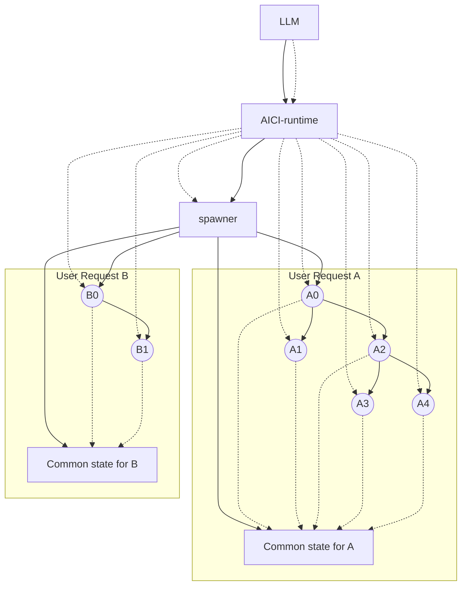

# AICI Runtime (aicirt)

Multi-threaded wasmtime-based runner.

Below is process structure.

- dotted arrow from A to B indicates that A sends requests to B (and gets responses)
- solid arrow from A to B indicates that A spawns (forks) B
- `spawner` is a special process, forked from `aicirt` at the beginning;
  for every user requests it spawns a process for top-level controller and a `common state` process 
  for handling shared state between
  all controller instances for that request (they can talk to the `common state` process)
- the top-level constraint can spawn more constraints, which can spawn yet more;
  `aicirt` has a direct connection to all these constraints though

