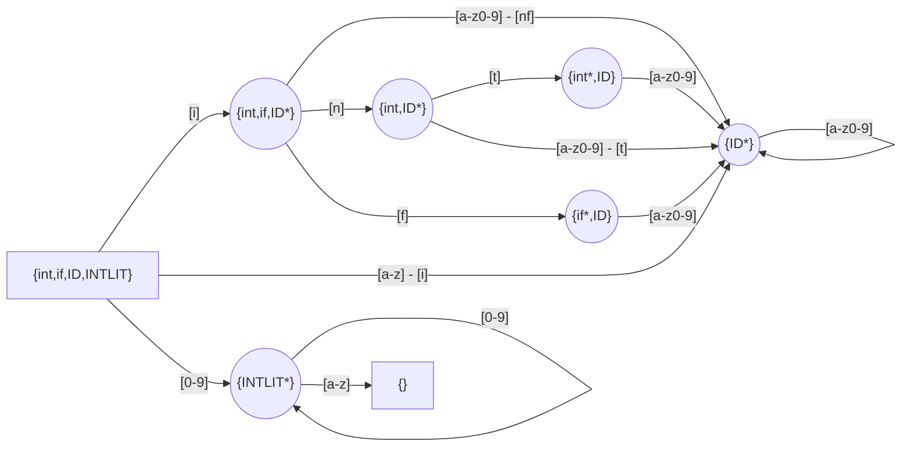

# Implementation notes

## Token trie

The round nodes represent tokens, the square nodes do not have a corresponding token.

The number (`num_parents`) specifies how many parents do you need to pop to get to the parent of the node which comes after our children in DFS order.

We also keep the `token_id` and a `subtree_size` (which includes the node itself) in each node.
A bogus `token_id` is used for nodes that do not have a corresponding token.

```mermaid
graph TD
  root[ε, 0] -- a --> a((a, 1))
  root -- b --> b((b, 1))
  root -- c --> c((c, 1))
  a -- x --> ax((ax, 1))
  a -- y --> ay[ay, 1]
  a -- z --> az((az, 2))
  az -- a --> azq((aza, 3))
  ay -- a --> ayq((aya, 1))
  ay -- b --> ayw((ayb, 2))
```



Traversal algorithm - computing the set of tokens allowed by a stack-based recognizer.
The set is stored in `logits` array - entries with `0.0` are allowed.

```rust
let mut logits = vec![-100.0; VOCAB_SIZE + 1];
```

A simple version of traversal algorithm:

```rust
fn traverse(n) {
    // mark token as allowed; nodes without token use `token_id == VOCAB_SIZE`
    logits[n.token_id] = 0.0;
    for c in n.children {
        // for every child that starts with an allowed byte
        if byte_allowed(c.byte) {
            push_byte(c.byte);
            // traverse it
            traverse(c);
            pop_bytes(1);
        }
    }
}
```

Now, assume the tree is laid out in memory in DFS order:

```rust
fn traverse(mut p) {
    let endp = p + nodes[p].subtree_size;
    p += 1; // move to first child
    while p < endp {
        let n = nodes[p];
        if byte_allowed(n.byte) {
            push_byte(n.byte);
            logits[n.token_id] = 0.0;
            // p is moved by n.subtree_size
            p = traverse(p);
            pop_bytes(1);
        } else {
            p += n.subtree_size;
        }
    }
}
```

Now, we get rid of the recursion:

```rust
let mut p = 0;
while p < nodes.len() {
    let n = nodes[p];
    if byte_allowed(n.byte) {
        push_byte(n.byte);
        logits[n.token_id] = 0.0;
        // if the node is a leaf, we need to pop all the parents
        pop_bytes(if n.subtree_size == 1 { n.num_parents } else { 0 });
        // move to first child, or sibling if no children
        p += 1;
    } else {
        // skip the children, and go to the sibling node
        p += n.subtree_size;
        // regardless if the node is a leaf, we need to pop all the parents
        pop_bytes(n.num_parents - 1);
    }
}
```

Note that the only branch that gets mis-predicted here is the `if byte_allowed(n.byte)`.
The `if` in argument to `pop_bytes` is compiled to bit operations, so it is branchless.

## LR(1) parsing

The LR(1) parsing consists of DFA-based lexer and the actual LR(1) parser.
DFA has a single number as the state, while the state of the LR(1) is a stack of numbers.
The LR(1) action is determined based on the next token from the lexer and the top of the stack.

The `Recognizer` interface also has a concept of stack, however every entry on that
stack contains a DFA state and an LR(1) stack.

Most of the time (~98.5% for the C grammar), pushing a byte involves only updating the DFA state,
while the LR(1) stack is copied unchanged (the memory is shared).


### Early error detection

Consider the following invalid C program:

```c
int 123456;
```

The lexer would produce `int` keyword, whitespace, `123456` constant and `;` keyword.
The parser would reject `123456`, however only after all six characters of it have been read.
This is too late for the LLM.

To detect such errors early, we compute a set of reachable tokens for each DFA state.
For example, consider a DFA that recognizes `int`, `if`, `ID` (`/[a-z][a-z0-9]*/`) and `INTLIT` (`/[0-9]+/`).
The initial DFA state has a full set of tokens, while a state after `'i'` 
has only `int`, `if`, and `ID`,
and a state after `'1'` includes only `INTLIT`.
In the picture below, each state is labelled by its reachable set,
and the token for which it is a match (if any) is postfixed with `*`. We only use lower-case letters and digits for simplicity.



For each LR(1) automaton state we compute a set of viable tokens, i.e., ones that do
not immediately lead to an error.

While parsing input, if the intersection of viable and reachable tokens is empty, we report an error.

In the example above, the viable tokens after `int` do not include `INTLIT`,
and thus the parser fails immediately at `1`.

